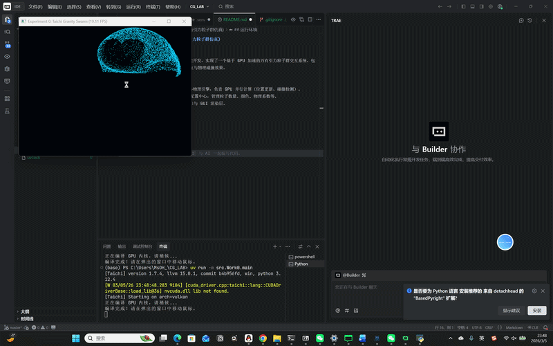

```
#### 2. Work0 专属文档 (`CG_LAB/src/Work0/README.md`)
```markdown
# Work0: 万有引力粒子群仿真

## 1. 项目简介
本项目基于 GPU 加速实现了一个万有引力粒子群交互系统。包含 10,000 个粒子，支持鼠标引力交互与物理边界碰撞反弹效果。

## 2. 运行方式
在项目根目录下（外层 `CG_LAB` 目录），执行以下命令以模块方式运行：
```bash
uv run python -m src.Work0.main
```

## 3. 效果展示

```