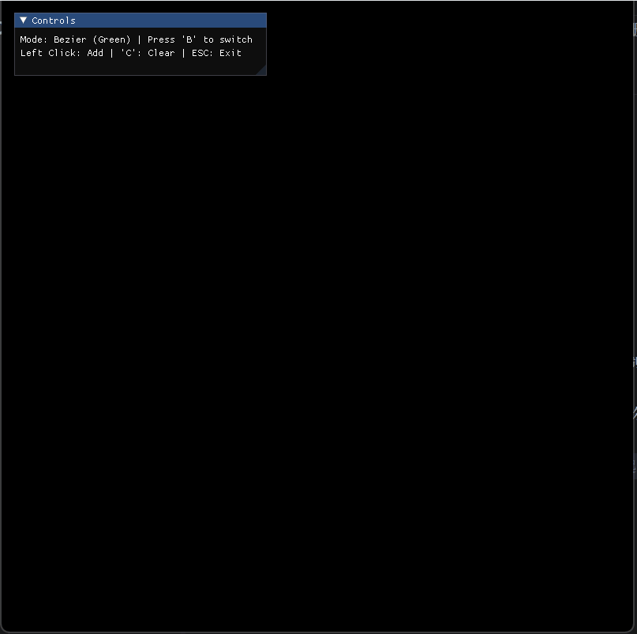

# Work2: 贝塞尔曲线与光栅化基础

## 1. 项目简介
本项目通过 Python + Taichi 框架，从底层数学逻辑实现了曲线坐标的计算及 GPU 像素级别光栅化绘制。
- **基础任务**：实现 De Casteljau 算法推导贝塞尔曲线，利用显存数组手动进行浮点数到整数像素坐标的映射。
- **选做任务**：增加距离加权模型的反走样 (Anti-Aliasing) 逻辑消除边缘锯齿；支持基于矩阵求值法的均匀三次 B 样条曲线生成与局部控制。

## 2. 运行方式
在项目根目录下（外层 `CG_LAB`），执行以下命令：

**运行基础贝塞尔曲线：**
```bash
uv run python -m src.Work2.main
```

**运行反走样及 B 样条进阶模块：**
```bash
uv run python -m src.Work2.bonus
```

## 3. 交互控制
- **鼠标左键**：在画布任意位置点击，添加新的控制点。
- **键盘 `C`**：一键清空当前所有控制点。
- **键盘 `B`**：在 `bonus` 模块中，切换 贝塞尔曲线(绿色) 与 B 样条曲线(青色)。
- **键盘 `ESC`**：退出程序。

## 4. 效果展示

### 基础：贝塞尔曲线光栅化


### 进阶：反走样与 B样条切换


学号：202411998324 
姓名：李佳澍
人工智能专业
