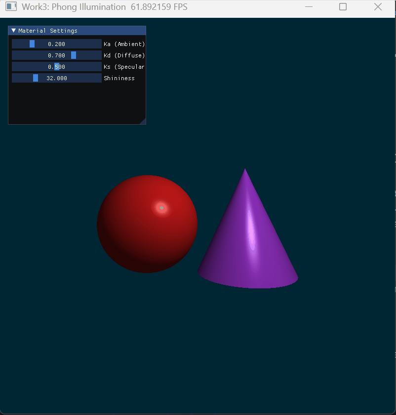
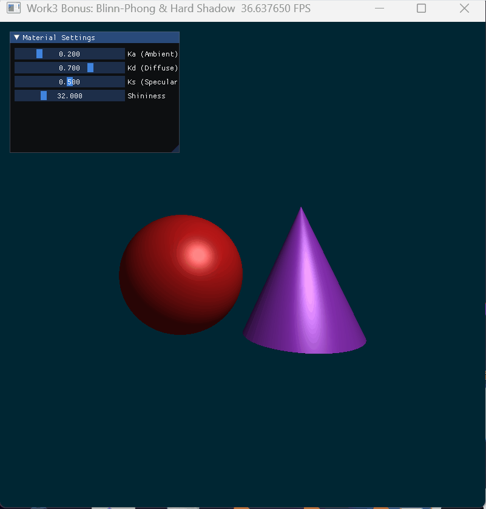

# Work3: 局部光照模型与交互式渲染

## 1. 项目简介
本项目基于光线投射法纯数学隐式构建了 3D 场景（球体与圆锥），并手动实现了基于 Z-Buffer 逻辑的深度遮挡测试。
- **基础任务**：实现了经典的 **Phong 光照模型**，分离计算环境光、漫反射与镜面高光，并搭建了实时的 UI 滑块交互面板。
- **进阶任务**：利用半程向量升级为 **Blinn-Phong** 材质，同时通过发射影子射线实现了真实的**几何硬阴影 (Hard Shadow)**。

## 2. 运行方式
在项目根目录下（外层 `CG_LAB`），执行以下命令：

**运行基础 Phong 光照：**
```bash
uv run python -m src.Work3.main
```

**运行进阶 Blinn-Phong 与硬阴影：**
```bash
uv run python -m src.Work3.app
```

## 3. UI 交互指南
在渲染窗口左上角提供了可实时调节的材质控件：
- `Ka (Ambient)`: 调节基础环境光强度。
- `Kd (Diffuse)`: 调节漫反射的表面粗糙散射强度。
- `Ks (Specular)`: 调节镜面高光（反光斑）的强度。
- `Shininess`: 调节高光指数（数值越大，反光斑越小越锐利，材质越像光滑金属）。

## 4. 效果展示

### 基础效果：Phong 模型


### 进阶效果：Blinn-Phong 模型与硬阴影
*(注：Blinn-Phong 使用半程向量 $H$，高光过渡在边缘大入射角处更为平滑真实。两个几何体的遮挡面产生了精准的物理阴影。)*


学号：202411998324 
姓名：李佳澍
人工智能专业
