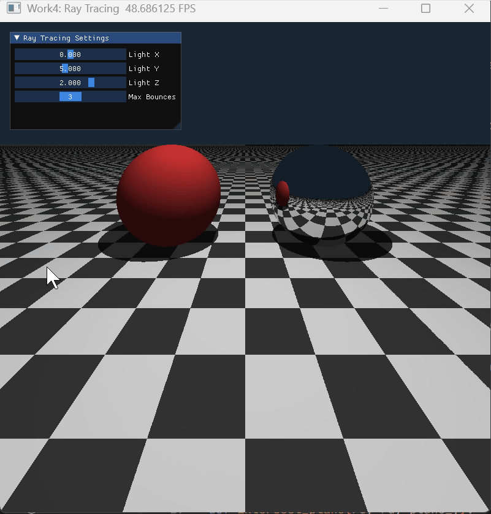

# Work4: 光线追踪 (Ray Tracing)

## 1. 项目简介
本项目通过 Taichi Kernel 的并行计算，实现了经典的 Whitted-Style 迭代光线追踪器。
- **基础任务**：将递归转化为迭代，支持漫反射表面与纯镜面反射物体的物理运算，通过发射暗影射线（Shadow Ray）实现了硬阴影，并通过极小偏移（$\epsilon=10^{-4}$）解决了自相交产生 Shadow Acne 的 Bug。
- **进阶任务**：利用斯涅尔定律计算透射向量并处理全反射（TIR），实现真实的物理玻璃折射材质。同时引入了基于随机采样的多重采样抗锯齿（MSAA），使边缘极其平滑。

## 2. 运行方式
在项目根目录下（外层 `CG_LAB`），执行以下命令：

**运行基础光线追踪（漫反射与镜面）：**
```bash
uv run python -m src.Work4.main
```

**运行进阶模块（玻璃折射与抗锯齿）：**
```bash
uv run python -m src.Work4.add
```

## 3. UI 交互指南
- `Light X/Y/Z`: 调节光源的空间位置，直观观察场景中硬阴影随光源的实时拉伸与形变。
- `Max Bounces`: 调节光线的最大弹射次数。当次数设为 1 时，镜面球为纯黑；设为大于 1 时可观察到完整的“镜中世界”。

## 4. 效果展示

### 基础：Whitted-Style 光线弹射与硬阴影


### 进阶：物理折射玻璃与 MSAA 抗锯齿
