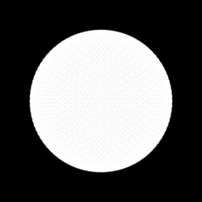
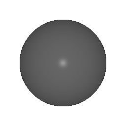

# Work5: 可微光栅化与网格优化

## 1. 项目简介
本项目基于 PyTorch3D 实现了三维网格（Mesh）的可微渲染与逆向优化。通过梯度下降算法，将一个初始的球体逐步优化（“捏”）成了目标奶牛的形状与纹理。
- **基础任务**：构建软光栅化器（Soft Rasterizer），通过多视角剪影（Silhouette）的 MSE Loss 结合拉普拉斯平滑、边长一致性及法线正则化惩罚，成功避免了梯度消失与拓扑崩坏（局部最优）问题。
- **进阶任务**：加入 `SoftPhongShader`，不仅拟合剪影，同时联合优化 RGB 图像，还原网格顶点颜色。

## 2. 运行环境与说明
由于涉及底层 CUDA/C++ 自定义算子，本实验代码已在 Google Colab (T4 GPU) 环境下成功运行。
依赖库：`torch`, `torchvision`, `pytorch3d`, `imageio`。

## 3. 效果展示

### 基础：多视角剪影软光栅化优化过程
*(展示了在三大正则化约束下，从球体平滑过渡到奶牛剪影的稳定优化过程)*

### 进阶：RGB 与几何联合优化过程
*(展示了形状变换与顶点色彩/纹理的反推恢复过程)*
