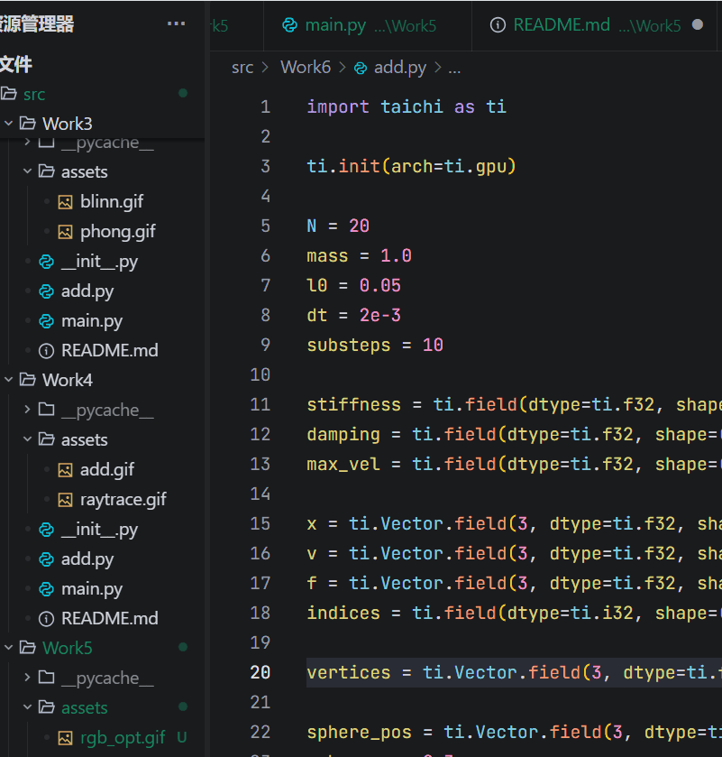

# Work6: 质点-弹簧模型与数值求解器

## 1. 项目简介
本项目利用 Taichi 构建了三维空间下的质点-弹簧物理系统（Mass-Spring System），高度复刻了布料等柔性物体的物理变形，并以底层节点（Particles）和连线（Lines）的形式进行了直观渲染。
- **基础任务**：利用单线程内联展开和多重 Kernel 循环设计，独立实现了 **显式欧拉 (Explicit)**、**半隐式欧拉 (Semi-Implicit)** 和 **隐式欧拉定点迭代 (Implicit)** 三种求解器，并在 UI 中提供复选框实时切换，可验证不同积分方法的稳定性差异。
- **进阶任务**：在结构弹簧 (Structural) 的基础上，补全了剪切 (Shear) 和弯曲 (Bending) 弹簧，并增加了刚体球体的连续碰撞检测响应。

## 2. 运行方式
在项目根目录下，执行以下命令：

**运行基础数值求解器对比：**
```bash
python -m src.Work6.main
```

**运行进阶全维度弹簧与碰撞测试：**
```bash
python -m src.Work6.bonus
```

## 3. 效果展示

### 1. 基础任务：质点弹簧模型与求解器
*(展示了质点弹簧网络在半隐式/隐式欧拉求解器下的稳定物理模拟过程)*


### 2. 【进阶】全维度弹簧与空间刚体碰撞
*(引入 Shear 与 Bending 弹簧增强网格稳定性，并与空间中的刚体球发生接触碰撞)*


学号：202411998324 
姓名：李佳澍
