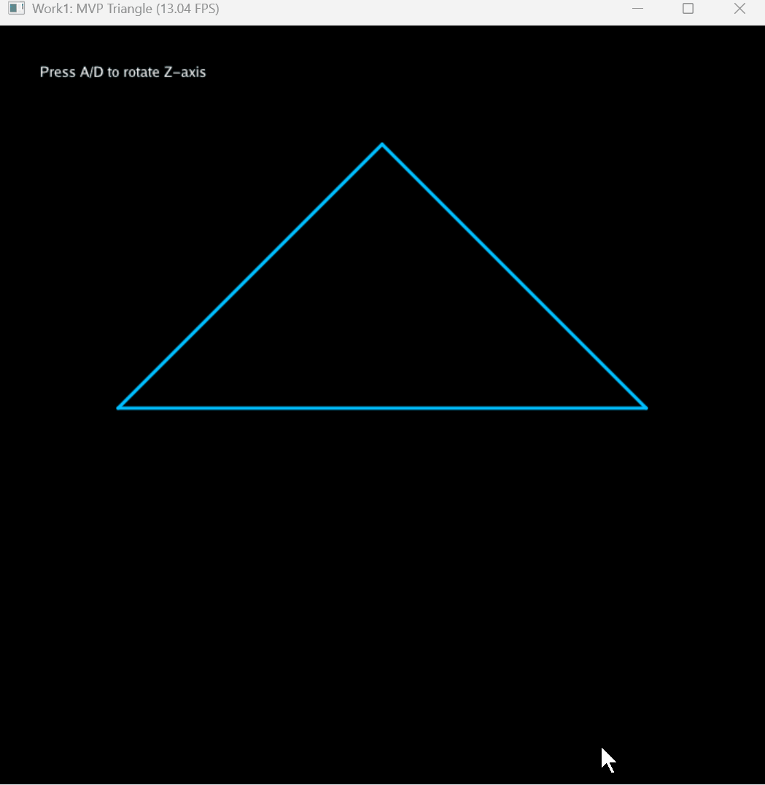
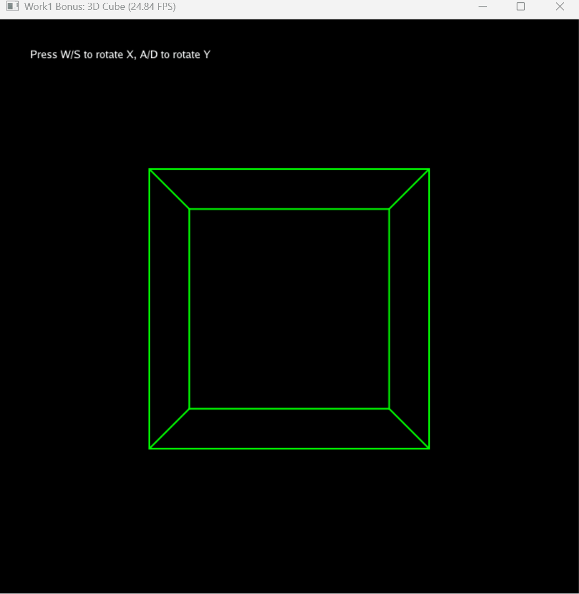

# Work1: 3D 空间坐标变换 (MVP)

## 1. 项目简介
本项目通过代码从零推导实现了三维空间中的 MVP（Model-View-Projection）矩阵变换。
- **基础任务** (`main.py`)：二维三角形的透视投影与 Z 轴旋转。
- **进阶任务** (`add.py`)：三维立方体的构建与绕 X、Y 轴的多轴独立旋转。

## 2. 文件结构

```text
Work1/
├── __init__.py
├── main.py        # 基础任务代码 (三角形)
├── add.py         # 进阶任务代码 (3D 立方体)
├── README.md      # 本文档
└── assets/        # 演示动图文件夹
    ├── triangle.gif
    └── cube.gif
```

## 3. 运行方式
在项目**根目录**下（外层 `CG_LAB` 目录），执行以下命令以模块方式运行：

**运行基础三角形：**
```bash
uv run python -m src.Work1.main
```

**运行 3D 立方体：**
```bash
uv run python -m src.Work1.add
```

## 4. 交互控制
- `main.py`: 按 `A` / `D` 绕 Z 轴旋转。
- `add.py`: 按 `W` / `S` 绕 X 轴翻滚，按 `A` / `D` 绕 Y 轴旋转。
- 全局: 按 `ESC` 退出。

## 5. 效果展示

**基础三角形：**


**进阶立方体：**
